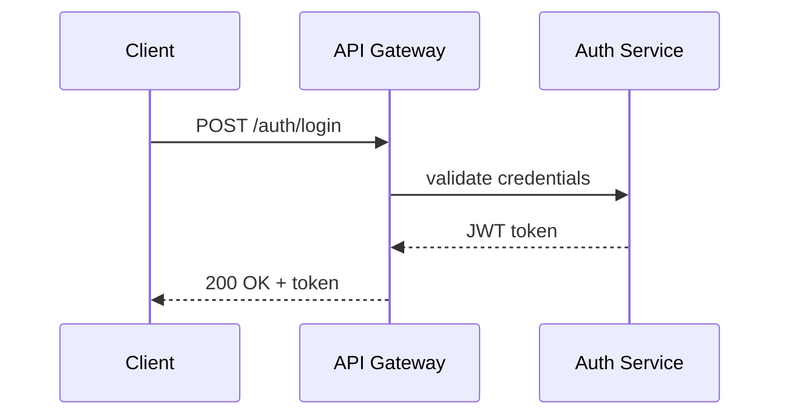
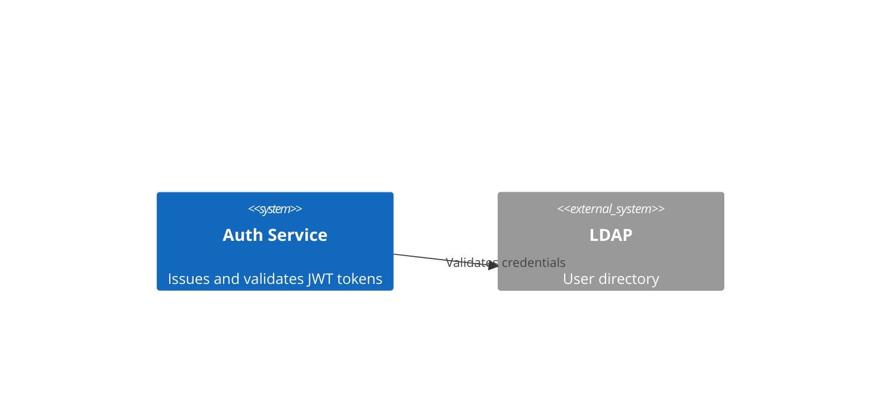
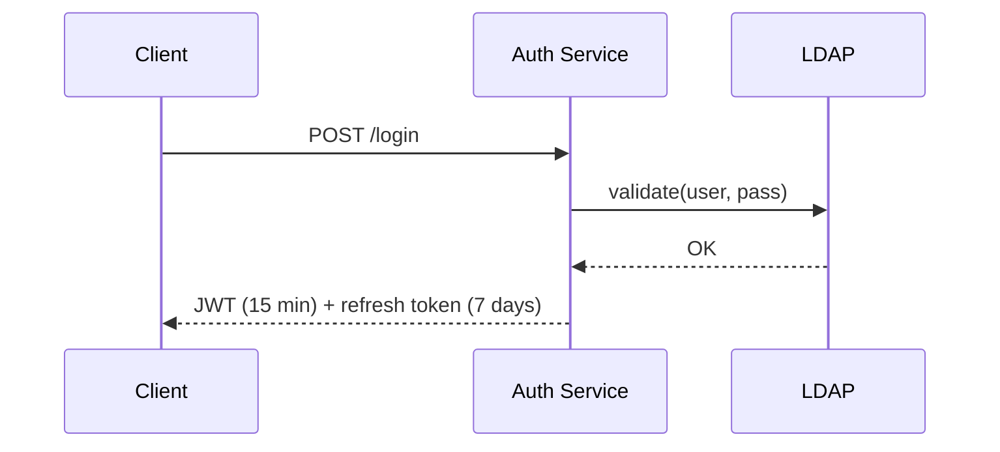

# Tech Docs

Write technical documentation that is structured, precise, and useful — from single files to multi-doc projects covering architecture, code, implementations, spikes, and general technical content.

## When to Use

- Writing architecture docs, ADRs, spike results, implementation guides, or README files
- Creating multi-file documentation projects with cross-links
- Adding Mermaid diagrams to explain flows, sequences, or system structure
- Documenting folder layouts with tree output

Don't use for:

- Inline code comments (use code-conventions)
- API reference generation from code (use tooling like TypeDoc or Swagger)
- Marketing or product copy

---

## Critical Patterns

### ✅ REQUIRED [CRITICAL]: Declare Audience at the Top

Every doc must state who it targets. Audience determines vocabulary, depth, and whether a glossary is needed.

```markdown
<!-- ✅ CORRECT: audience declared in doc header -->
**Audience:** Engineering team  
**Audience:** Engineering + Product (non-technical readers included)

<!-- ❌ WRONG: no audience — reader doesn't know what to expect -->
# Auth Service Architecture
```

### ✅ REQUIRED: One-Level Title Hierarchy, No Skipping

Use `#` for the doc title only. Sections are `##`. Subsections are `###`. Never jump from `##` to `####`.

```markdown
<!-- ✅ CORRECT -->
# Payment Service

## Overview
### Responsibilities

<!-- ❌ WRONG: jumped from ## to #### -->
# Payment Service
#### Responsibilities
```

### ✅ REQUIRED: Short Paragraphs, No Walls of Text

Max 3 sentences per paragraph. Use lists for 3+ parallel items. Every sentence must earn its place.

```markdown
<!-- ✅ CORRECT: tight, scannable -->
The service handles payment capture, refunds, and chargebacks.
It integrates with Stripe via webhook events.

<!-- ❌ WRONG: paragraph wall -->
The service is responsible for handling payment capture as well as refunds
and chargebacks, and it also integrates with Stripe through the use of
webhook events which are sent to the endpoint registered during setup.
```

### ✅ REQUIRED: Use Mermaid for Architecture and Flows

Any time you describe a system interaction, data flow, state machine, or sequence — draw it. Do not narrate what a diagram would show.

Diagram types to use:

- `flowchart LR` — data pipelines, decision flows, CI steps
- `sequenceDiagram` — API calls, auth flows, service interactions
- `classDiagram` — domain models, ERDs
- `stateDiagram-v2` — order states, lifecycle
- `C4Context` — system-level architecture (requires C4 extension)
- `erDiagram` — database schemas
- `gantt` — project timelines, spike schedules

````markdown
<!-- ✅ CORRECT: Mermaid renders in GitHub natively -->


<!-- ❌ WRONG: prose narration of a flow -->
The client sends a login request to the API Gateway, which forwards it
to the Auth Service, which validates and returns a JWT.
````

### ✅ REQUIRED: One .mmd File Per Diagram (Only When Explicitly Requested)

If the user asks for exportable diagrams, create a `.mmd` source file alongside the markdown. Never create `.mmd` files by default.

```
docs/architecture/
├── overview.md
└── diagrams/
    └── auth-flow.mmd    ← only when explicitly requested
```

The `.mmd` file contains the raw Mermaid source (no fences). Use `mmdc` to render:

```bash
mmdc -i auth-flow.mmd -o auth-flow.png
```

### ✅ REQUIRED: Show Folder Structure with Tree

Use `tree` output (or a tree-style code block) for any folder layout. Label each entry inline.

```
project/
├── src/
│   ├── api/          # HTTP handlers
│   └── services/     # Business logic
├── docs/
│   └── architecture/ # ADRs and diagrams
└── tests/
```

### ✅ REQUIRED: Standard Multi-File Doc Layout

For doc projects with 3+ documents, use a standard folder layout.

```
docs/
├── architecture/     # System design, ADRs, C4 diagrams
├── spikes/           # Time-boxed research results
├── implementation/   # How-to guides and runbooks
├── api/              # Contract docs (OpenAPI, GraphQL schema)
└── README.md         # Index with links to all docs
```

Custom paths are valid — announce the structure at the start of the doc set.

### ✅ REQUIRED: Mixed-Audience Docs Need an Executive Summary

When audience includes non-engineers, open with a 3–5 sentence plain-language summary before any technical content.

```markdown
<!-- ✅ CORRECT for mixed audience -->
## Executive Summary

This spike evaluates three caching strategies for the product search API.
The recommended option reduces average response time by 40% with no schema changes.
Full technical details follow.

## Technical Analysis
...
```

### ✅ REQUIRED: Spike Docs Follow a Fixed Structure

```markdown
# Spike: [Topic]

**Goal:** One sentence — what question does this spike answer?  
**Time box:** X days  
**Audience:** [Engineering | Engineering + Product]  
**Status:** In progress | Complete

## Findings

## Options Evaluated

| Option | Pros | Cons | Effort |
|--------|------|------|--------|

## Recommendation

## Next Steps
```

### ✅ REQUIRED: Architecture Docs Follow a Fixed Structure

```markdown
# [System/Component] Architecture

**Audience:** [Engineering | Engineering + Product]  
**Last updated:** YYYY-MM-DD

## Context

## Design

[Mermaid diagram here]

## Components

## Data Flow

[Mermaid sequence diagram here]

## Decision Log

| Decision | Rationale | Date |
|----------|-----------|------|

## Open Questions
```

### ❌ NEVER: Mix Confluence/Notion Syntax with GitHub Markdown

GitHub-primary docs must use standard Markdown only. For cross-platform content, note incompatibilities explicitly.

```markdown
<!-- ❌ WRONG: Confluence macro in a GitHub file -->
{info}This is a note{info}

<!-- ✅ CORRECT: GitHub-native callout (using blockquote) -->
> **Note:** Mermaid diagrams do not render in Confluence — export as PNG first.
```

---

## Decision Tree

```
What type of doc?
  → Architecture → Use Architecture Doc structure + Mermaid C4/flowchart
  → Spike → Use Spike Doc structure + options table
  → Implementation guide → H2 sections per step, code blocks, tree for folder layout
  → README → short overview, badges, quick-start, links to full docs
  → General → H1 title + H2 sections, audience declaration at top

Who is the audience?
  → Devs only → skip executive summary, use technical vocabulary
  → Mixed → add Executive Summary before technical content, define acronyms

Does the doc describe a system interaction or flow?
  → Yes → add Mermaid diagram (choose type below)
  → No → no diagram needed

Choosing Mermaid diagram type?
  → Service-to-service calls → sequenceDiagram
  → Decision flow or pipeline → flowchart LR
  → System boundary overview → C4Context
  → Domain model or schema → classDiagram or erDiagram
  → State lifecycle → stateDiagram-v2
  → Timeline → gantt

Does the doc show folder layout?
  → Yes → use tree-style code block with inline labels

User explicitly requests exportable diagrams?
  → Yes → create docs/diagrams/{name}.mmd alongside the markdown
  → No → embed Mermaid inline only

Single file or multi-file project?
  → Single → standard section hierarchy, audience header at top
  → Multi-file → use standard docs/ layout, README.md as index with links
  → Custom path specified → announce structure in README.md

Platform target?
  → GitHub → native Mermaid, relative links, standard Markdown
  → Confluence/Notion → export diagrams as PNG, note rendering limits
```

---

## Example

Architecture doc for a dev-only audience:

```markdown
# Auth Service Architecture

**Audience:** Engineering  
**Last updated:** 2026-06-18

## Context

Handles user authentication and session management for all internal services.

## Design



## Components

| Component | Responsibility |
|-----------|---------------|
| Token issuer | Signs JWT with RS256 |
| Session store | Redis-backed token cache |
| LDAP adapter | Credential validation |

## Data Flow



```

---

## Edge Cases

**Large diagram → hard to read in Markdown:** Split into two focused diagrams rather than one mega-diagram. Each diagram should answer one question.

**Mixed platform delivery:** Default to GitHub syntax. At the top of docs destined for Confluence, add a callout block noting which elements need manual conversion (Mermaid → PNG, relative links → absolute URLs).

**Versioned docs:** Add `**Version:** X.Y` to the header and keep old versions in `docs/archive/` rather than deleting them.

**Spike with no clear winner:** The Recommendation section must still exist — state "no clear winner" and give the next step (e.g., prototype option B with real traffic data). Never leave it blank.
